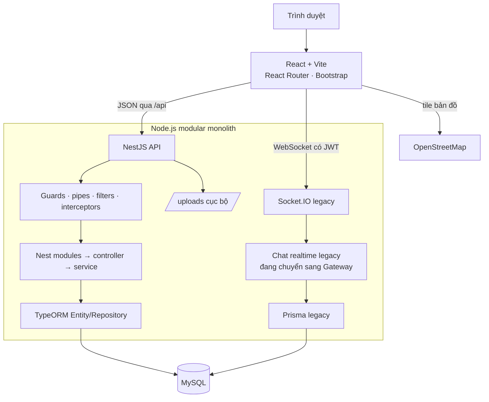

# Kiến trúc hệ thống

## Tổng quan

Đây là một **modular monolith** cho bài toán quản lý và tìm kiếm phòng trọ sinh viên. Một ứng dụng React chạy trên trình duyệt gọi REST API tới NestJS/TypeORM và MySQL. Mã Node.js/Express, Prisma và Socket.IO hiện có được giữ như lớp legacy trong quá trình chuyển từng feature module, không có microservice, message broker hay cơ sở dữ liệu tách riêng.

Mã nguồn được tách thành hai workspace:

| Khu vực | Vị trí | Trách nhiệm |
| --- | --- | --- |
| Client | `client/` | React, Vite, React Router, Bootstrap, Axios, Leaflet và Socket.IO client |
| Server | `server/` | NestJS, TypeORM, config, Entity và các feature module đang được chuyển đổi |
| Legacy server | `server/src/**/*.js` | Express, Socket.IO, JWT/RBAC, Zod và service/controller cũ, giữ tạm để port dần |
| Database | `server/src/database/` | TypeORM Entity/enum/cấu hình; Prisma schema/migration cũ còn là baseline dữ liệu |

## Sơ đồ thành phần



Leaflet hiển thị marker từ dữ liệu phòng có tọa độ. Tọa độ trường và tiện ích gần đó được seed sẵn. Khi chủ trọ tạo hoặc sửa khu trọ, họ có thể nhập địa chỉ và chủ động bấm tìm vị trí; server gọi HTTPS tới Nominatim/OpenStreetMap qua hostname cố định, rồi đối chiếu các khu trọ đã lưu của chính chủ trọ trước khi thử Photon nếu nguồn trước không phản hồi. Kết quả được kiểm tra, cache ngắn hạn và giới hạn một truy vấn mỗi giây. Client lấy `University.isPrimary` qua REST API để đặt trường/tâm bản đồ ưu tiên (seed là Đại học Phenikaa), thay vì gắn cứng dữ liệu trong giao diện. Các nguồn này chỉ cung cấp dữ liệu bản đồ/địa chỉ, không phải nguồn dữ liệu nghiệp vụ.

## Luồng xử lý HTTP

```text
Request /api
  → router theo domain
  → authenticate/authorize (khi cần)
  → validate Zod
  → controller (điều phối HTTP)
  → service (quy tắc nghiệp vụ + ownership)
  → Prisma/MySQL
  → envelope JSON thống nhất hoặc error handler tập trung
```

Controller không chứa truy vấn nghiệp vụ phức tạp. Các domain được đặt dưới `server/src/modules/`; phần dùng chung (phân trang, serializer, notification helper và select Prisma) nằm ở `modules/_shared` hoặc `utils`.

## Các ranh giới nghiệp vụ

| Nhóm | Trách nhiệm chính |
| --- | --- |
| Tài khoản | Đăng ký với username và/hoặc email, đăng nhập bằng một trong hai, profile, đổi mật khẩu, JWT và role `STUDENT`/`LANDLORD`/`ADMIN` |
| Tin đăng | University, Property, Room, ảnh, tiện ích, tìm kiếm, khoảng cách, điểm phù hợp, lịch sử giá và lượt xem |
| Tương tác sinh viên | Favorite, roommate profile/post/request, nhóm thuê và conversation/message |
| Thuê phòng | Lịch xem, contract, tenant và invoice/item |
| Tin cậy/vận hành | Verification, review, report, notification và thao tác quản trị |

Tất cả kiểm tra quyền nằm ở server. Ví dụ, landlord chỉ được thay đổi property/room thuộc sở hữu; người dùng chỉ đọc conversation, hóa đơn hoặc hợp đồng mà họ là thành viên liên quan; endpoint quản trị yêu cầu `ADMIN`.

## Bảo mật và tính nhất quán

- Password lưu bằng bcrypt; response serializer không trả `passwordHash`.
- `username` và `email` là hai định danh đăng nhập độc lập, mỗi giá trị unique; request đăng ký cần ít nhất một định danh. Username được chuẩn hóa lowercase và không chứa `@`, nên server xác định rõ username hay email mà không đổi lẫn namespace.
- Access token là JWT Bearer, kiểm tra thuật toán HS256 và trạng thái tài khoản trước khi gán `req.user`.
- Zod kiểm tra body/query; lỗi được chuẩn hóa thay vì trả stack trace cho client production.
- Helmet, CORS theo `CLIENT_URL`, giới hạn tốc độ các route `/api/auth` và giới hạn body được cấu hình tại lớp ứng dụng.
- Socket.IO xác thực JWT ở handshake, sau đó kiểm tra `ConversationMember` trước khi join/gửi tin nhắn.
- Prisma foreign key, unique constraint và transaction/service guard bảo vệ các quan hệ; các bất biến liên trường được xác thực tại service/validator.

## Realtime và dữ liệu ngoài

Socket.IO dùng chung HTTP server với Express. Sự kiện chat lưu `Message` trước khi phát `message:new`, nên lịch sử còn lại sau khi tải lại trang. Link Zalo/Telegram chỉ là URL do thành viên nhóm cung cấp; hệ thống không gọi API không chính thức.

Express phục vụ file ảnh cục bộ tại `/uploads`. `POST /api/rooms/:id/images/upload` dùng multipart, chỉ nhận JPEG/PNG/WebP, giới hạn 8 tệp và 5 MB mỗi tệp; route yêu cầu LANDLORD sở hữu room hoặc ADMIN. Middleware tự gán phần mở rộng theo MIME và service xác thực magic bytes trước khi ghi bản ghi ảnh, đồng thời dọn file khi request bị từ chối. Room vẫn có thể nhận URL ảnh trong JSON. Khi `SERVE_CLIENT=true` và `client/dist` đã được build, cùng Express đó còn phục vụ asset React và SPA fallback, sau các route `/api` và `/uploads`. Thiết kế không buộc vào một dịch vụ lưu trữ đám mây; provider có thể được thay thế sau này mà không đổi contract nghiệp vụ.

`POST /api/properties/geocode` chỉ dành cho LANDLORD/ADMIN đã đăng nhập và nhận duy nhất chuỗi địa chỉ đã kiểm tra độ dài. Nó không nhận URL từ client: hostname Nominatim và Photon đều được cố định, HTTPS/TLS giữ nguyên, redirect không được theo sau, timeout 8 giây, kết quả được whitelist về tên hiển thị và tọa độ hợp lệ. Khi cần đối chiếu dữ liệu cục bộ, server chỉ đọc các khu trọ thuộc chính tài khoản chủ trọ đang thao tác. Vì các dịch vụ geocoding công cộng không dành cho autocomplete hoặc lưu lượng lớn, client chỉ gọi khi người dùng bấm nút, server cache tối đa 100 truy vấn trong 15 phút và giới hạn thêm theo IP.

## Giới hạn kiến trúc hiện tại

- Thời gian di chuyển được ước tính từ khoảng cách Haversine, không phải kết quả routing giao thông thực tế.
- Không có payment gateway, chữ ký số hoặc tích hợp xác minh trường học thật.
- Geocoding địa chỉ dùng Nominatim/OpenStreetMap, dữ liệu khu trọ cùng chủ và Photon làm dự phòng cho thao tác chủ trọ bấm nút; khi triển khai lưu lượng lớn cần thay provider hoặc tự host dịch vụ tương thích.

Trạng thái từng chức năng và giao diện được theo dõi trong [features.md](features.md); tài liệu này chỉ mô tả cấu trúc và ranh giới kỹ thuật.
