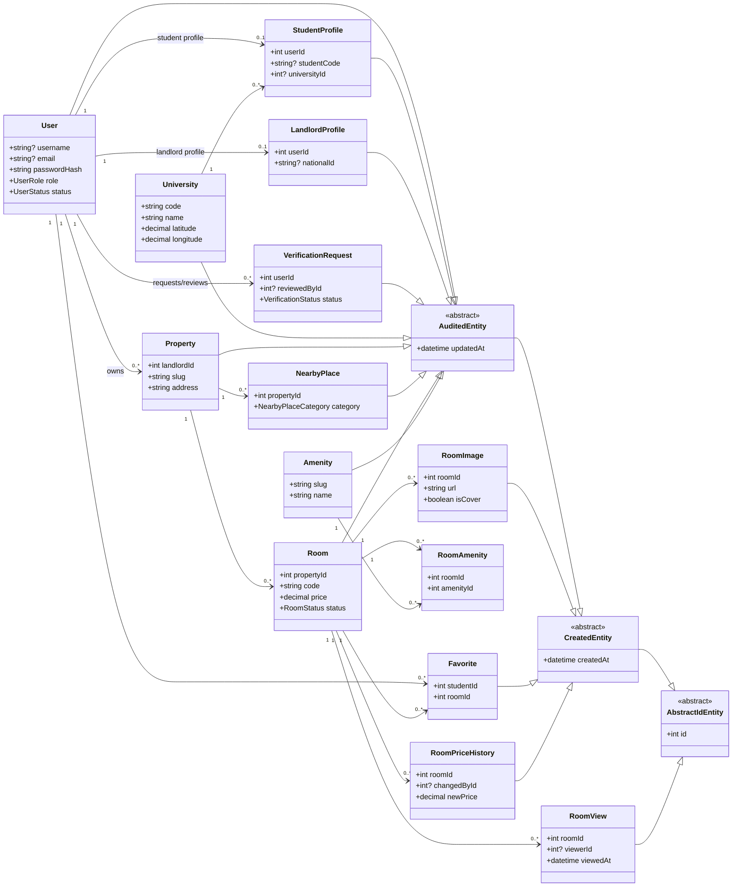
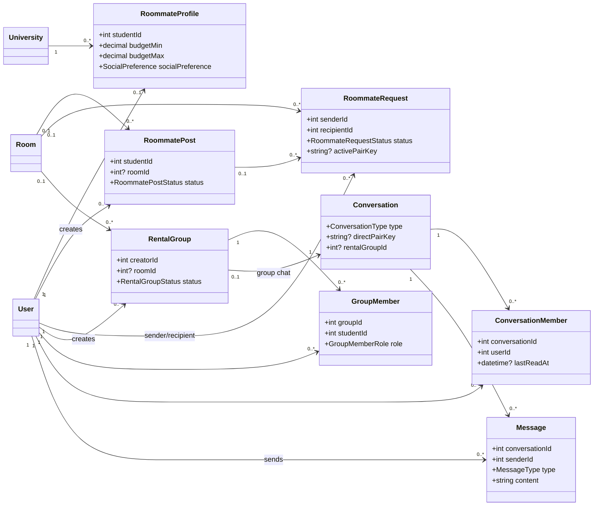
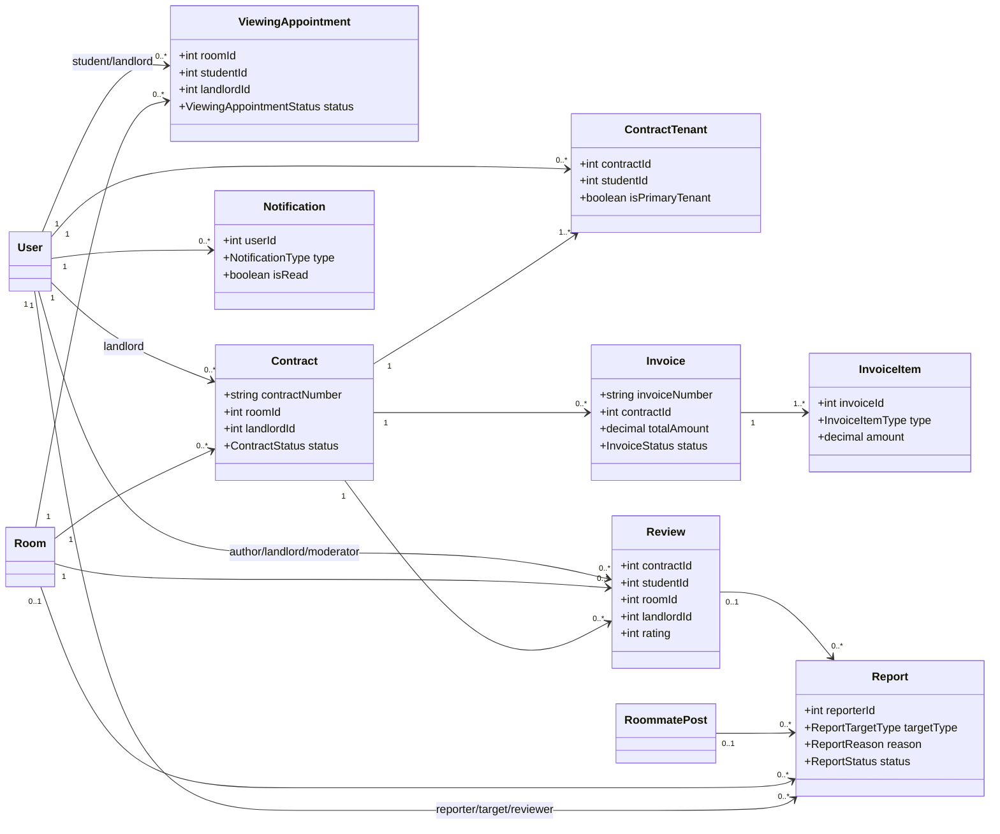

# Biểu đồ lớp — Website quản lý và tìm kiếm phòng trọ sinh viên

Tài liệu này là biểu đồ lớp dùng trước khi triển khai Entity NestJS/TypeORM.
Nó kế thừa dữ liệu và quan hệ từ [ERD](erd.md), nhưng bổ sung lớp cơ sở,
multiplicity và ranh giới nghiệp vụ. Mỗi lớp thực thể được ánh xạ sang một bảng
MySQL bằng `@Entity()`.

## Quy ước thiết kế

- `User` là thực thể tài khoản duy nhất. Sinh viên và chủ trọ là role của
  `User`, kết hợp lần lượt với `StudentProfile` và `LandlordProfile`; không
  dùng kế thừa `Student extends User` hoặc `Landlord extends User`.
- `AbstractIdEntity`, `CreatedEntity` và `AuditedEntity` chỉ tái sử dụng các
  cột kỹ thuật. Các bản ghi lịch sử không có `updated_at` chỉ kế thừa
  `CreatedEntity`.
- Các bảng nối có dữ liệu nghiệp vụ (`RoomAmenity`, `Favorite`,
  `GroupMember`, `ConversationMember`, `ContractTenant`) là Entity riêng.
- Kiểu tiền tệ/toạ độ dùng `DECIMAL`, vì vậy Entity biểu diễn chúng bằng
  `string`, không dùng `number` dễ làm tròn sai.

## Tài khoản, vị trí và tin phòng

## Ở ghép và trò chuyện

## Thuê phòng, hoá đơn và kiểm duyệt

## Quy tắc không thể biểu diễn hoàn toàn bằng decorator

- `username` hoặc `email` phải tồn tại; profile phải phù hợp `User.role`.
- `availableSlots` không vượt `capacity`; chỉ một ảnh cover; các tổng hoá đơn,
  ngày hợp đồng và meter phải hợp lệ.
- `RoommateRequest.activePairKey` chỉ unique khi request `PENDING`; direct
  conversation cần `directPairKey`, group conversation cần `rentalGroupId`.
- `Report` phải có đúng một target tương ứng với `targetType`; review,
  appointment, thành viên chat và hợp đồng phải thoả quan hệ nghiệp vụ.

Các quy tắc trên sẽ nằm trong DTO, service và transaction của các feature
module NestJS, không đặt trong Entity.
