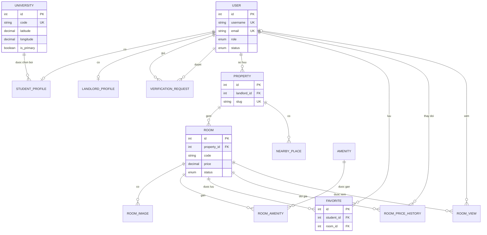
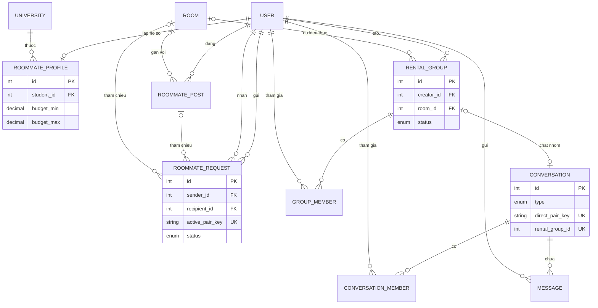
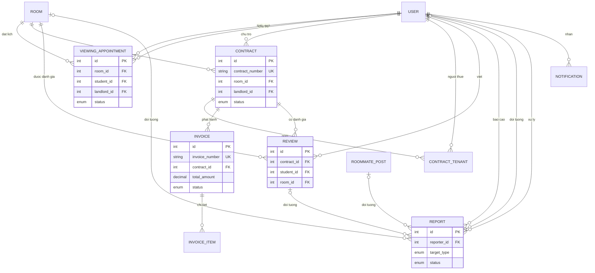

# ERD

ERD dưới đây phản ánh quan hệ trong Prisma schema. Tên entity là tên model Prisma; tên bảng MySQL dùng `snake_case` tương ứng. Xem [database.md](database.md) để biết key/index và [schema.prisma](../server/prisma/schema.prisma) là nguồn chuẩn cho mọi field.

## Tài khoản, tin đăng và tìm kiếm

## Ở ghép và trò chuyện

## Thuê phòng, hóa đơn và kiểm duyệt

## Bảng nối và uniqueness

| Bảng | Quan hệ biểu diễn | Ràng buộc chống trùng |
| --- | --- | --- |
| `room_amenities` | Room N–N Amenity | PK kép `(roomId, amenityId)` |
| `favorites` | Student N–N Room | `(studentId, roomId)` unique |
| `group_members` | Student N–N RentalGroup | `(groupId, studentId)` unique |
| `conversation_members` | User N–N Conversation | `(conversationId, userId)` unique |
| `contract_tenants` | Student N–N Contract | `(contractId, studentId)` unique |
| `roommate_requests` | Workflow sender–recipient | `activePairKey` unique khi request đang `PENDING` |

`directPairKey` ngăn tạo trùng cuộc trò chuyện trực tiếp; `(contractId, periodStart, periodEnd)` ngăn hóa đơn trùng kỳ; `(contractId, studentId)` ngăn review lặp cho cùng hợp đồng. Các quan hệ xóa/cập nhật chi tiết nằm trong Prisma schema và migration, không suy ra từ sơ đồ khái niệm này.

Trong `USER`, `username` và `email` đều có thể để trống riêng lẻ, nhưng ứng dụng bắt buộc ít nhất một định danh khi đăng ký. Cả hai đều unique; username được chuẩn hóa lowercase và không dùng ký tự `@`, nên có thể phân biệt rõ với email khi đăng nhập.
